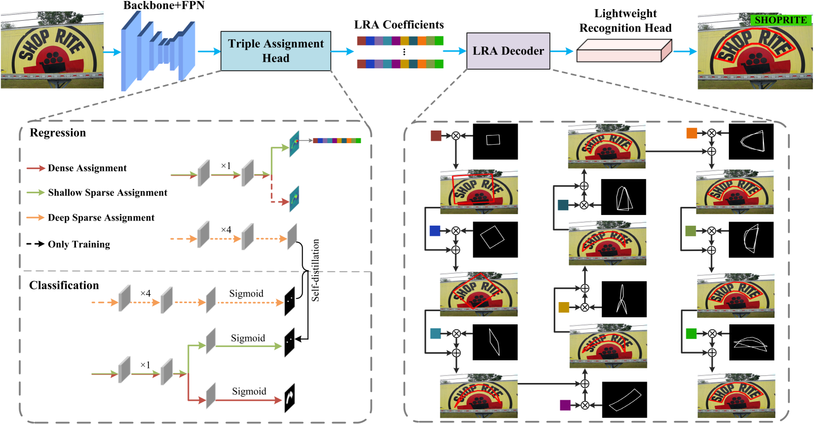

# <h1 align="center"> LRANet++: Low-Rank Approximation Network for Accurate and Efficient Text Spotting </h1> 

<div align="center">
    
</div>

This is the official implementation of Paper: [LRANet++: Low-Rank Approximation Network for Accurate and Efficient Text Spotting](https://arxiv.org/abs/2511.05818.pdf).

## Environment
This implementation is based on mmocr-0.2.1, so please refer to it for detailed requirements. Our code has been tested with Pytorch-1.8.1 + cuda11.1
We recommend using [Anaconda](https://www.anaconda.com/) to manage environments. Run the following commands to install dependencies.
```
conda create -n lranet_pp python=3.7 -y
conda activate lranet_pp
conda install pytorch=1.8 torchvision cudatoolkit=11.1 -c pytorch -c nvidia -c conda-forge
pip install mmcv-full==1.3.9 -f https://download.openmmlab.com/mmcv/dist/cu111/torch1.8.0/index.html
pip install mmdet==2.15.1
git clone https://github.com/ychensu/LRANet-PP
cd LRANet-PP
pip install -r requirements.txt
python setup.py build develop
cd mmocr/models/textend2end/utils/grid_sample_batch
python setup.py build develop
```

## Dataset
- ICDAR2017-MLT [[image]](https://github.com/aim-uofa/AdelaiDet/blob/master/datasets/README.md)
- Syntext-150k: [[image]](https://github.com/aim-uofa/AdelaiDet/tree/master/configs/BAText)
- ICDAR2015 [[image]](https://drive.google.com/file/d/1w1aCczgUaZum7_oBda34QzxdeDOCoVJ_/view?usp=drive_link)
- ICDAR2013 [[image]](https://drive.google.com/file/d/12j7PlDVdxxtQ6X3azzy9tPOEqGygVL9O/view?usp=drive_link)
- CTW1500 [[image]](https://drive.google.com/file/d/1Qv2QMjgIblTSCB6rG9RHj8m_0gAp8ZHH/view?usp=drive_link)
- Total-Text [[image]](https://drive.google.com/file/d/1R6EXhWHbJnRnSbIMfS-DJ6syKtx0ppr6/view?usp=drive_link)


The prepared annotations can be downloaded from [Google Drive](https://drive.google.com/drive/folders/1ZNsd49I2M7BPwTo_9OHRraQpvRSOT_kO?usp=sharing)

Please download and extract the above datasets into the `data` folder following the file structure below.
```
data
├─totaltext
│  │ totaltext_train.json
│  │ totaltext_test.json
│  │ training
│  │ test
│  
├─CTW1500
│  │ ctw1500_train.json
│  │ ctw1500_test.json
│  │ training
│  │ test
│  
├─synthtext-150k
      ├─syntext1
      │  │  syntext1_train.json
      │  └─train_images
      ├─syntext2
         │  syntext2_train.json
         └─train_images
```

## Generate LRA Basis (Optional)
```
python orthanchors/generate_lra.py --json_path <your_json_path> --output_dir <output_dir>
```


## Train
### Pretrain
```
CUDA_VISIBLE_DEVICES=0,1,2,3 bash tools/dist_train.sh configs/lranet_pp/lranet_pp_pretrain.py work_dirs/pretrain 4
```
### Finetune
```
CUDA_VISIBLE_DEVICES=0,1,2,3 bash tools/dist_train.sh configs/lranet_pp/lranet_pp_totaltext.py work_dirs/totaltext 4 --load-from work_dirs/pretrain/latest.pth
```


## Evaluation
```
CUDA_VISIBLE_DEVICES=0 python tools/test.py configs/lranet_pp/lranet_pp_totaltext.py work_dirs/totaltext/latest.pth --eval hmean-e2e
```


## Trained Model
Pretrain: [OneDrive](https://1drv.ms/u/c/5aa69fbe58464061/IQAH8ZP_LJw4R6j9nMoUFw-fAcuW3mdI5eo5h8kPg30TGzc?e=xEtpTG)
Total-Text : [OneDrive](https://1drv.ms/u/c/5aa69fbe58464061/IQAz-BfPQKuZTKjs8tPpor5AATNt4ogaHSeYUOgi-r1VqCs?e=23EdwX)
CTW1500: [OneDrive](https://1drv.ms/u/c/5aa69fbe58464061/IQDJa-bLosXBS51ijQdseJrGAVxe3V2KVmBlStnflnqsESI?e=r57sbi)


## Citing the related works 
```
@inproceedings{su2024lranet,
  title={LRANet: Towards accurate and efficient scene text detection with low-rank approximation network},
  author={Su, Yuchen and Chen, Zhineng and Shao, Zhiwen and Du, Yuning and Ji, Zhilong and Bai, Jinfeng and Zhou, Yong and Jiang, Yu-Gang},
  booktitle={Proceedings of the AAAI Conference on Artificial Intelligence},
  volume={38},
  number={5},
  pages={4979--4987},
  year={2024}
}

@article{su2025lranet++,
  title={LRANet++: Low-Rank Approximation Network for Accurate and Efficient Text Spotting},
  author={Su, Yuchen and Chen, Zhineng and Du, Yongkun and Wu, Zuxuan and Xie, Hongtao and Jiang, Yu-Gang},
  journal={arXiv preprint arXiv:2511.05818},
  year={2025}
}
```
